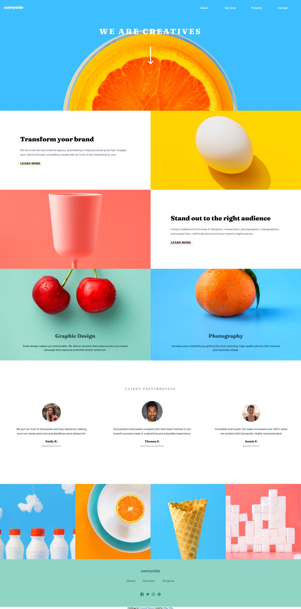

# Frontend Mentor - Sunnyside agency landing page solution

This is a solution to the [Sunnyside agency landing page challenge on Frontend Mentor](https://www.frontendmentor.io/challenges/sunnyside-agency-landing-page-7yVs3B6ef). Frontend Mentor challenges help you improve your coding skills by building realistic projects.

## Table of contents

- [Overview](#overview)
  - [The challenge](#the-challenge)
  - [Screenshots](#screenshots)
  - [Links](#links)
- [My process](#my-process)
  - [Built with](#built-with)
- [Author](#author)

## Overview

### The challenge

Users should be able to:

- View the optimal layout for the site depending on their device's screen size
- See hover states for all interactive elements on the page

### Screenshots

### Links

- Solution URL: [https://github.com/felipevilar/sunnyside-agency](https://github.com/felipevilar/sunnyside-agency)
- Live Site URL: [https://felipevilar.github.io/sunnyside-agency/](https://felipevilar.github.io/sunnyside-agency/)

## My process

### Built with

- Semantic HTML5 markup
- CSS custom properties
- CSS Grid
- Flexbox
- Mobile-first workflow

## Author

- LinkedIn - [Felipe Vilar](https://www.linkedin.com/in/felipe-vilar/)
- Frontend Mentor - [@felipevilar](https://www.frontendmentor.io/profile/felipevilar)
- GitHub - [Felipe Vilar](https://github.com/felipevilar)

